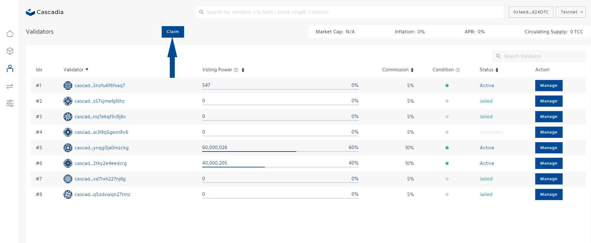

# Claim Rewards

**Step 1: Navigate to** [**https://validator.cascadia.foundation/validators**](https://validator.cascadia.foundation/validators) **and connect your wallet.**

<figure><figcaption></figcaption></figure>

**Step 2: Click the “Manage” button of the validator to claim your delegation rewards.**

<figure><figcaption></figcaption></figure>

**Step 3: On the pop-up window, click on the "Claim Reward" button.**

<figure><figcaption></figcaption></figure>

**Step 4: Make sure the information is correct, click on the ''Claim Reward'' button, and confirm your transaction in your wallet.**


You can claim rewards together by clicking the **''Claim''** button for validators you have delegated to.


<figure><figcaption></figcaption></figure>
