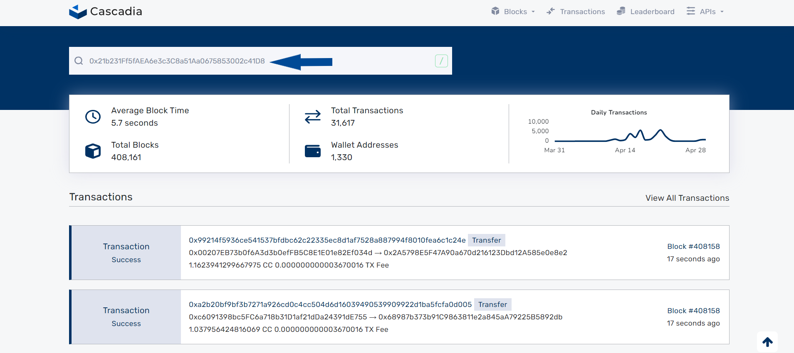
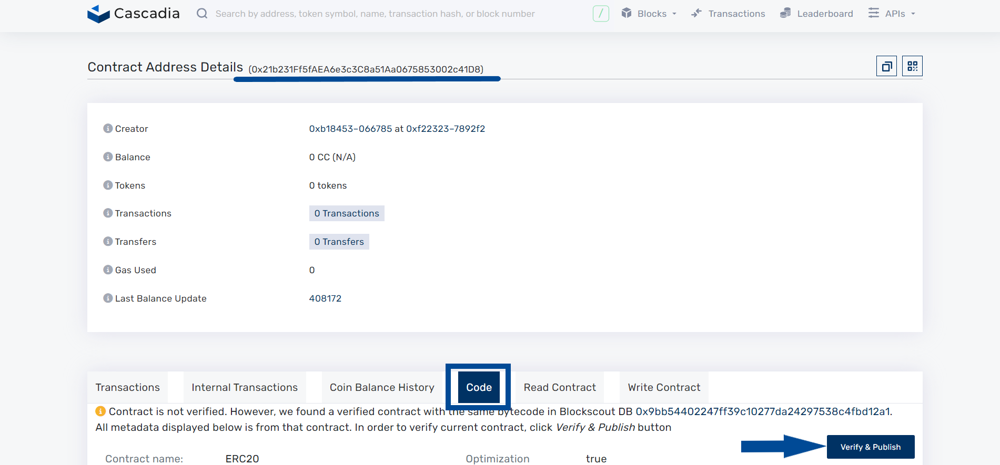
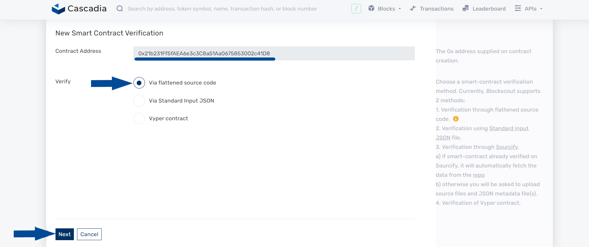
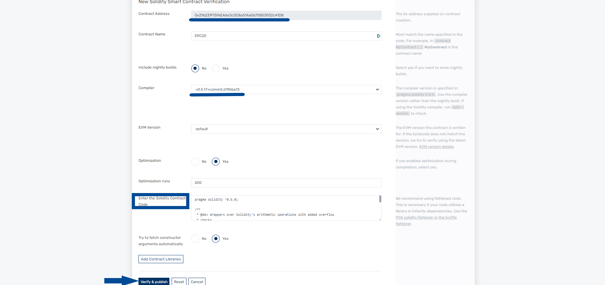
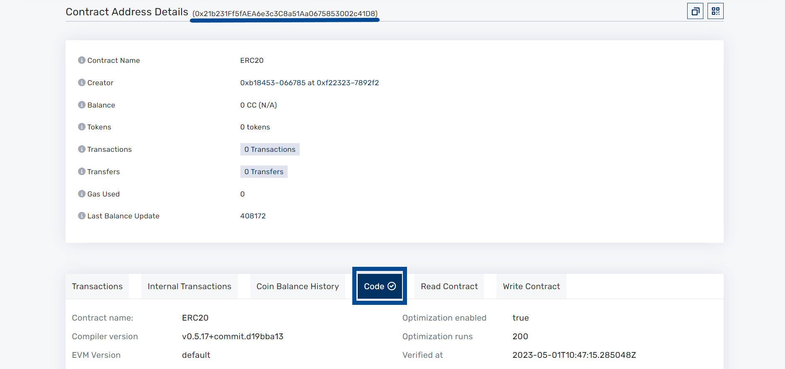

# Via Block Explorer

#### **Step 1:** Navigate to [explorer.cascadia.foundation](https://explorer.cascadia.foundation/) and input the contract address you wish to verify in the search bar.

<figure><figcaption></figcaption></figure>

**Step 2: Click on the "Code" tab and then select the "Verify & Publish" option.**

<figure><figcaption></figcaption></figure>

**Step 3: Select the "Via flattened source code" method, then click "Next"..**

<figure><figcaption></figcaption></figure>

**Step 4: Fill out the required fields, including the Solidity Contract Code, and finalize the process by clicking "Verify & Publish".**

<figure><figcaption></figcaption></figure>

**Step 5: Verify the accuracy of the contract address you inputted in Step 1 by selecting "Code". If the verification was successful, you will be able to see the contract is now marked as verified.**

<figure><figcaption></figcaption></figure>
