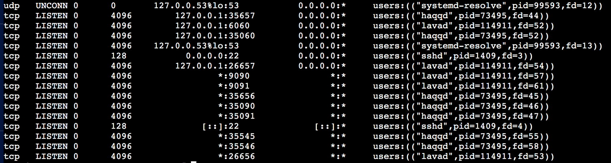

---
layout:
  title:
    visible: true
  description:
    visible: false
  tableOfContents:
    visible: true
  outline:
    visible: true
  pagination:
    visible: true
---

# Model

In the vote-escrowed model:

* Vote: Users receive a certain number of ve-tokens based on the length of their lockup period.  Since ve tokens are used for governance, community members who lock their tokens for a longer period of time retain more influence.
* Escrowed: Users decide how long they wish to keep their tokens locked. Early unstaking is not possible.  Over the chosen time frame, tokens unlock incrementally.

Vote-locking amplifies user incentives by providing committed community members additional influence over decisions and/or reward distribution.  Users that lock their tokens are motivated to make deliberate, involved decisions as they have committed to holding for some period of time, which in term aligns these users with the protocol's long-term health.

Combining [block reward distribution](../../network/distribution/block-rewards.md) and [gas fee distribution](../../network/distribution/gas-fees.md), our veCC model appears as follows:

<figure><figcaption></figcaption></figure>

In practice, based on both feedback received from stakeholders (nProtocols, Validators, and veCC holders) and [automated system feedback](../../cybernetics/system-design.md), Cascadia will be able to adjust distribution of both block rewards or gas fees dynamically to align with environmental factors. This is the core value proposition of cybernetics.
