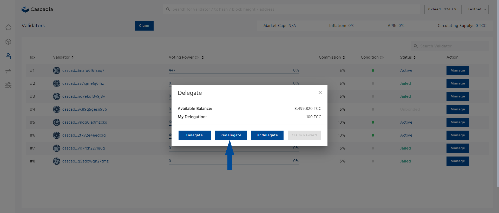

# Redelegate

Redelegation allows a user to move delegated tokens between validators without being subject to the unbonding period.

**Step 1: Navigate to** [**https://validator.cascadia.foundation/validators**](https://validator.cascadia.foundation/validators) **and connect your wallet.**

<figure><figcaption></figcaption></figure>

**Step 2: Click the “Manage” button of the validator you would like to redelegate your tokens.**

<figure><figcaption></figcaption></figure>

**Step 3: On the pop-up window, click on the "Redelegate" button.**

<figure><figcaption></figcaption></figure>

**Step 4: Enter the desiered amount, click ''Redelegate'', and confirm your transaction.**
