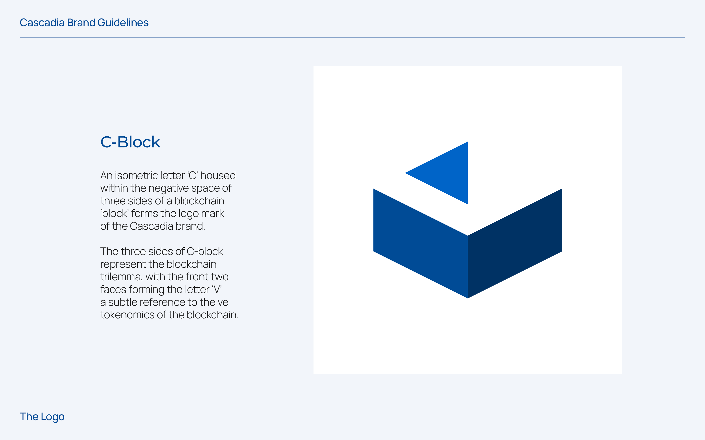
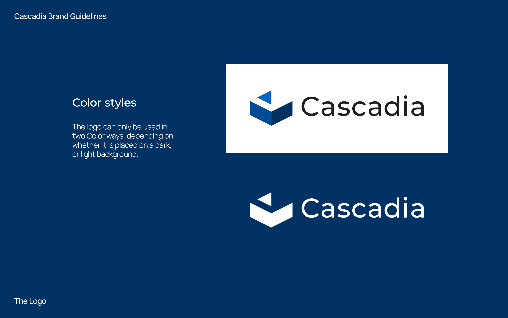
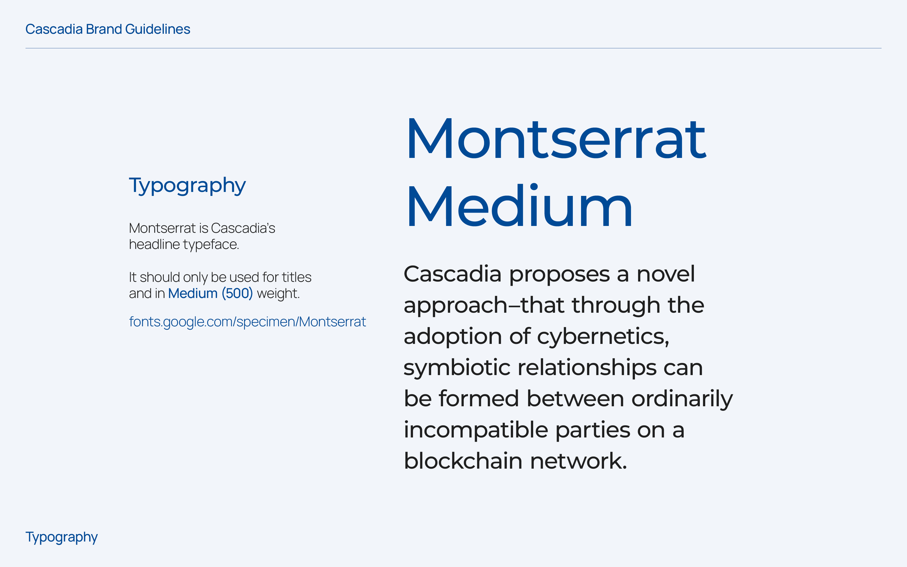
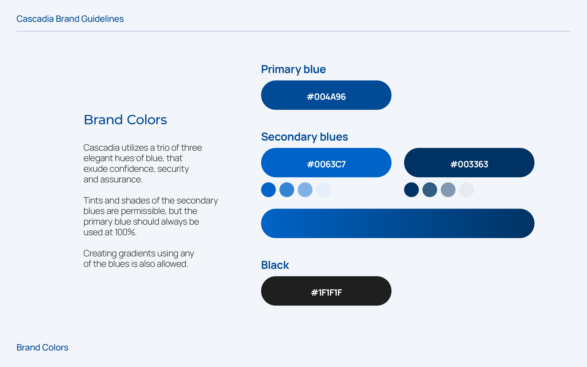

---
layout:
  title:
    visible: true
  description:
    visible: false
  tableOfContents:
    visible: true
  outline:
    visible: true
  pagination:
    visible: true
---

# Brand Guidelines

The Cascadia logo features an isometric letter "C" located within the negative space formed by three facets of a symbolic blockchain "block." This configuration signifies the blockchain trilemma, while the two front facets delineate the letter "V," subtly alluding to Cascadia's unique ve-tokenomics structure.


These branding assets are an integral part of Cascadia's visual identity that ensures consistency and confidence for all participants.


**Logo**

<figure><figcaption></figcaption></figure>

 

<figure><figcaption></figcaption></figure>

<figure><figcaption></figcaption></figure>

<figure><figcaption></figcaption></figure>

**Typography**

<figure><figcaption></figcaption></figure>

**Brand Colors**

<figure><figcaption></figcaption></figure>
