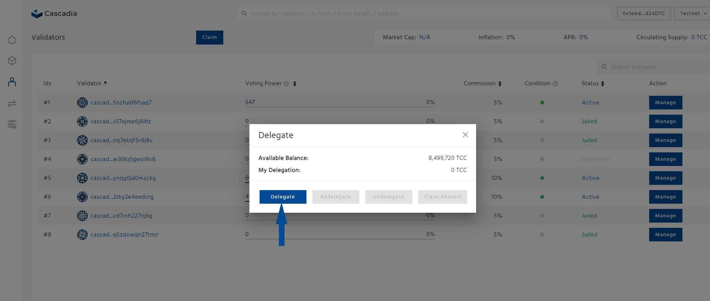
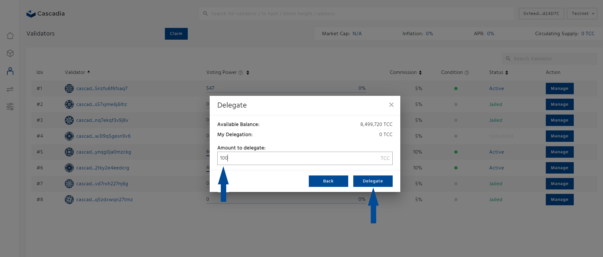

---
layout:
  title:
    visible: true
  description:
    visible: false
  tableOfContents:
    visible: true
  outline:
    visible: true
  pagination:
    visible: true
---

# Delegate


When you delegate your tokens, you lock up your tokens for a period of time to contribute to Cascadia's network security.


**Step 1: Navigate to** [**https://validator.cascadia.foundation/validators**](https://validator.cascadia.foundation/validators) **and connect your wallet.**

<figure><figcaption></figcaption></figure>

**Step 2: Click the “Manage” button of the validator you would like to redelegate your tokens.**

<figure><figcaption></figcaption></figure>

**Step 3: On the pop-up window, click on the "Delegate" button.**

<figure><figcaption></figcaption></figure>

**Step 4: Enter the amount of tokens you wish to delegate and click the "Delegate" button.**

<figure><figcaption></figcaption></figure>

**Step 5: Review and sign the transaction in your wallet to complete the process.**
